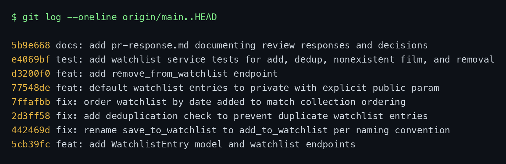

# PR Response Doc — CineLog Watchlist Feature

This document records my responses to the six review comments left by the maintainer
(`@dev-lead`) on the watchlist PR: what I changed, why, and my written arguments for the
two design decisions (Comments 4 and 5).

---

## AI Usage

I used an AI assistant (Claude) in the following ways during this project:

- **Codebase orientation.** Before reading the review comments, I had the AI summarize
  `models.py`, `services/collection_service.py`, and `tests/test_collection.py` so I
  understood the existing patterns (the `verb_to_noun` naming, how `add_to_collection()`
  raises `AlreadyInCollectionError` on a duplicate, how `get_collection()` sorts
  `date_added DESC`, and how the pytest fixtures are structured). I verified every summary
  against the actual code before relying on it.
- **Pattern confirmation for Comment 2.** I asked the AI to walk through what
  `add_to_collection()` returns when the film doesn't exist and how its duplicate check
  works, then wrote my own `add_to_watchlist()` check modeled on it.
- **Commit-format hygiene.** I had the AI sanity-check my `git log --oneline` against the
  Conventional Commits spec and CONTRIBUTING.md.
- **Drafting the design arguments (Comments 4 and 5).** I made both design decisions myself:
  watchlist entries should default to **private**, because a user's "want to watch" list is
  personal and not everyone wants it exposed; and the list should sort **newest-first**,
  matching the collection. After deciding the positions, I used AI to help develop and write
  the written arguments — including having it argue the opposing side ("a community app should
  default to public," "alphabetical is easier to scan") so I could address those
  counterarguments in the Tradeoff / Engagement sections. The decisions are mine; the AI
  helped me articulate and word the reasoning.

> Note to reader: the positions in Comments 4 and 5 are my own decisions. The prose was
> drafted with AI assistance and then reviewed by me for agreement with my reasoning.

---

## Comment 1 — Rename `save_to_watchlist()` → `add_to_watchlist()`

> _(inline, `services/watchlist_service.py`)_ `save_to_watchlist()` should follow the
> project's naming convention. Compare with `add_to_collection()` — the pattern here is
> `verb_to_noun`. Please rename and update all call sites.

**What I did:**
Renamed the service function to `add_to_watchlist()` and updated the one call site in
`routes/watchlist/watchlist.py` (both the `import` and the call inside `add_film`). This
brings the watchlist service in line with the collection service's `verb_to_noun` names
(`add_to_collection`, `remove_from_collection`, `get_collection`), which CONTRIBUTING.md
lists as the required convention.

**How I verified:**
Ran a project-wide search (`grep -rn "save_to_watchlist" --include="*.py"`) and confirmed
zero remaining references. `pytest tests/ -v` stayed green.

---

## Comment 2 — Deduplication

> _(inline, `services/watchlist_service.py`)_ What happens if a user calls this with a film
> that's already on their watchlist? The current implementation would add a duplicate
> entry. Please handle this case.

**What I did:**
Followed the exact pattern used by `add_to_collection()`. I added an
`AlreadyInWatchlistError` exception and, in `add_to_watchlist()`, query for an existing
`WatchlistEntry` with the same `(user_id, film_id)` **before** inserting; if one exists I
raise `AlreadyInWatchlistError` instead of creating a duplicate. I also mirrored the
collection route's error handling in `routes/watchlist/watchlist.py`: the add endpoint now
returns **409 Conflict** for a duplicate and **404** for a nonexistent film (previously it
had no error handling and would have surfaced a 500).

**How I verified:**
Modeled the check on `collection_service.add_to_collection()` (lines 47–53), which does the
same `filter_by(...).first()` guard. Added `test_add_to_watchlist_duplicate_raises`, which
adds the same film twice, asserts `AlreadyInWatchlistError`, and confirms only one row
exists. `pytest` passes.

---

## Comment 3 — Missing test (nonexistent `film_id`)

> _(conversation)_ Please add a test for the case where `film_id` doesn't exist in the
> database. Look at the existing tests in `test_collection.py` — the pattern is there.

**What I did:**
Created `tests/test_watchlist.py` using the same fixtures as `test_collection.py`
(`app` with an in-memory SQLite DB, `sample_user`, `sample_film`). I wrote
`test_add_to_watchlist_nonexistent_film_raises` as the direct equivalent of
`test_add_to_collection_nonexistent_film_raises`: it calls `add_to_watchlist` with a
UUID that isn't in the DB and asserts `FilmNotFoundError` is raised (not a DB integrity
error).

**How I verified:**
Used `test_add_to_collection_nonexistent_film_raises` as my model, including its
`"00000000-0000-0000-0000-000000000000"` fake id. `pytest tests/test_watchlist.py -v`
passes, and so does the full suite (9 tests).

---

## Comment 4 — Default visibility (`public`)

> _(conversation)_ I notice watchlists default to `public=True`. We don't have a documented
> decision on default visibility for user lists. Before I can approve this, I need you to
> add a note explaining your reasoning — I want to make sure we're being intentional, not
> just inheriting a default.

**My position:**
Entries default to private (`public=False`). I added a `public` parameter so a caller can
make one public when they add it.

**Reasoning:**
A watchlist isn't the same kind of list as a collection. A collection is what you've already
watched and rated, and it already feeds `Film.average_rating`, so it's semi-public by design.
A watchlist is what you plan to watch, which is more personal — not everyone wants other
people seeing what they're considering. Defaulting to public shares that without the user
choosing to, which is the "inheriting a default" the comment flagged. Private-by-default
makes sharing a deliberate choice instead.

The costs also aren't symmetric. If the default is private and someone never shares, they
lose a bit of discoverability. If the default is public and they didn't notice, something
they considered private is already exposed and can't be taken back. That difference is why I
defaulted to private.

**Tradeoff acknowledged:**
CineLog is a community app, so private-by-default does cost some discovery — people can't
browse each other's watchlists without opting in. I added the `public` parameter in the same
change to keep sharing cheap (`{"public": true}`), so the UI can offer a toggle when adding a
film. Sharing stays easy; it just isn't automatic.

---

## Comment 5 — Sort order

> _(inline, `services/watchlist_service.py`)_ I'd prefer watchlists to default to
> "date added" order rather than alphabetical. Most users want to see what they added
> recently. I'm open to discussion — but let's make a decision and document it.
> _(A second reviewer agreed, noting the mirror case: sometimes a user wants the oldest
> item they added, to finally cross it off.)_

**My position:**
`get_watchlist()` now sorts by `date_added` newest-first instead of alphabetically by title.

**Reasoning:**
Alphabetical only helps when you're looking for a specific title, which isn't the common case
for your own watchlist — usually you're checking what you added recently, or what's been
sitting there a while. The main reason is consistency: `get_collection()` already sorts
newest-first (the README documents it that way), so sorting the watchlist alphabetically would
make a user's two lists behave differently for no real reason. It's also less code — I dropped
the `join(Film)` the alphabetical sort needed.

**Engagement with reviewer's point:**
The other reviewer's point about wanting the oldest item, to finally cross it off, is fair.
But that's a different use case from the default view, and making oldest-first the default
would just break the more common "what did I add recently" case instead. A sort option on the
GET endpoint (`?sort=oldest`) handles it better than changing the default. So: newest-first
now, matching the collection, with room to add sorting later if that need comes up.

---

## Comment 6 — Rebase onto updated `main` (integer → UUID)

> _(conversation)_ A refactor merged to `main` that changed film IDs from integers to UUIDs.
> Your watchlist code still references integer IDs. Please rebase on `main` and update
> accordingly.

**What conflicted:**
`main` had two commits my branch didn't: the UUID refactor (`Film.id` and
`CollectionEntry.film_id` migrated from `Integer` to `String(36)`) and a `.gitignore`.
When I rebased `feature/watchlist` onto `origin/main`, the conflict was in `models.py`: my
branch added a `WatchlistEntry` whose `film_id` was declared `db.Integer` with a foreign key
to `film.id`, while `main` had migrated `film.id` (and the sibling `CollectionEntry.film_id`)
to `db.String(36)`. Leaving the watchlist column as an integer FK to a UUID primary key would
have been a type mismatch.

**How I resolved it:**
I kept `main`'s UUID definitions for `Film` and `CollectionEntry`, and changed
`WatchlistEntry.film_id` to `db.String(36)` so the watchlist references films the same way
everything else now does. I also updated the integer-era references that the migration made
stale: the `film_id` docstrings in `services/watchlist_service.py` and the request-body
comments in the route now say UUID rather than `<int>`. The pre-existing local `.gitignore`
was dropped in favor of `main`'s (they were nearly identical). The final branch is rebased
linearly on top of `main` with **no merge commits**.

**How I verified no conflict remains:**
`grep -n "<<<<<<<\|>>>>>>>\|=======" models.py` returns nothing; `git log --merges
origin/main..HEAD` is empty (linear history); `grep "db.Integer" models.py` shows no
`film_id` columns still using it; and the full test suite passes against the UUID schema.
(During history cleanup in Milestone 4 I rebuilt the branch as a linear series of atomic
commits on top of `origin/main`, so every commit — not just the tip — carries the UUID
definitions.)

---

## Stretch work

- **`remove_from_watchlist(user_id, film_id)`** — Implemented following the
  `remove_from_collection()` pattern: it looks up the `(user_id, film_id)` entry, raises a new
  `NotInWatchlistError` if it isn't there, otherwise deletes it and returns `True`. Exposed as
  `DELETE /watchlist/<user_id>/remove` (returns 404 on `NotInWatchlistError`). Covered by
  `test_remove_from_watchlist_deletes_entry` and `test_remove_from_watchlist_not_present_raises`.
- **Second (unrequested) test** — `test_add_to_watchlist_duplicate_raises`. I chose the
  duplicate case because it's the one that silently corrupts data if the dedup guard from
  Comment 2 ever regresses: a missing 404 is loud, but a missing dedup check just quietly
  creates a second row. A regression test on that path protects the Comment 2 fix.
- **Visibility toggle** — Added the `public` parameter to `add_to_watchlist()` and the add
  endpoint (`{"film_id": "...", "public": true}`), so callers set visibility explicitly rather
  than relying on the default. This is the same change that backs the Comment 4 decision.

---

## PR Description

**What the feature does.** Adds a watchlist so users can save films they *intend* to watch,
separate from their collection of films already watched. It introduces a `WatchlistEntry`
model and REST endpoints to add a film to a watchlist, remove one, and view the list. Entries
store a `date_added` timestamp and a `public` visibility flag.

**Endpoints**
- `POST /watchlist/<user_id>/add` — body `{"film_id": "<uuid>", "public": <bool?>}` → 201 (409 if already present, 404 if the film doesn't exist)
- `DELETE /watchlist/<user_id>/remove` — body `{"film_id": "<uuid>"}` → 200 (404 if not present)
- `GET /watchlist/<user_id>` — returns the watchlist, newest first

**Design decisions**
1. **Default visibility = private (`public=False`).** A watchlist records viewing *intent*,
   which is more sensitive than an already-watched collection, so visibility is opt-in via an
   explicit `public` parameter rather than a public-by-default. (See Comment 4.)
2. **Sort order = date added, newest first.** Matches `get_collection()`'s existing ordering
   so a user's two lists behave consistently, and serves the common "what did I just add" case.
   (See Comment 5.)

**How to manually test end to end**

1. Start the app:
   ```bash
   python app.py            # serves on http://localhost:5000
   ```
2. The DB starts empty and there's no create-film/user endpoint, so seed one user and one
   film (in a second terminal — same `cinelog.db`):
   ```bash
   python -c "
   from app import create_app, db
   from models import User, Film
   with create_app().app_context():
       u = User(username='alice', email='alice@example.com')
       f = Film(title='Dune', year=2021, genre='Sci-Fi')
       db.session.add_all([u, f]); db.session.commit()
       print('USER_ID =', u.id); print('FILM_ID =', f.id)
   "
   ```
3. Exercise the endpoints (substitute the printed IDs):
   ```bash
   # add (private by default) -> 201, "public": false
   curl -sX POST localhost:5000/watchlist/USER_ID/add \
        -H 'Content-Type: application/json' -d '{"film_id": "FILM_ID"}'

   # add the same film again -> 409 (dedup)
   curl -sX POST localhost:5000/watchlist/USER_ID/add \
        -H 'Content-Type: application/json' -d '{"film_id": "FILM_ID"}'

   # add a nonexistent film -> 404
   curl -sX POST localhost:5000/watchlist/USER_ID/add \
        -H 'Content-Type: application/json' -d '{"film_id": "no-such-id"}'

   # view watchlist (newest first)
   curl -s localhost:5000/watchlist/USER_ID

   # remove -> 200, then removing again -> 404
   curl -sX DELETE localhost:5000/watchlist/USER_ID/remove \
        -H 'Content-Type: application/json' -d '{"film_id": "FILM_ID"}'
   ```
4. Or just run the automated suite: `pytest tests/ -v` (9 passing).

---

## Commit history

Final `git log --oneline` on `feature/watchlist` (relative to `main`) — linear, Conventional
Commits, no merge commits:

```
docs: add pr-response.md documenting review responses and decisions
test: add watchlist service tests for add, dedup, nonexistent film, and removal
feat: add remove_from_watchlist endpoint
feat: default watchlist entries to private with explicit public param
fix: order watchlist by date added to match collection ordering
fix: add deduplication check to prevent duplicate watchlist entries
fix: rename save_to_watchlist to add_to_watchlist per naming convention
feat: add WatchlistEntry model and watchlist endpoints
```

_Screenshot: _ &nbsp;<!-- Replace with your terminal
screenshot: run `git log --oneline origin/main..HEAD` and save the image to docs/git-log.png -->
